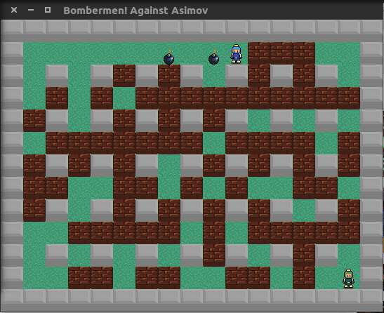

# About

This project is another bomberman based game C++ implementation, but with an unusual approach. In this game, you're alleged
to design an artificial intelligence to play the game and test it against other people or against my demo AI (not done yet).

# Install (Linux)

To install you'll need SFML library and a C++11 or above compatible compiler, preferably clang. To install SFML library:

	~$ sudo apt install libsfml-dev

To build the project, simply make:

	~$ make

To run in debugging stance, add a -d or --debug flag on execution:

	~$ ./baa.out -d

In debugging stance, an extra window will show up with command instructions. If no flags are given, the program will run in normal mode, in which no user inputs are needed.

To set your own AI code, see README.md at AIs folder. You'll yet need to recompile the code and change it to run your own AI, but there are plans to change the projects architecture for the sake of making it easier and more natural for you to import your AI.
The project is alleged to be system independent, which means you can compile it in any machine a long as you link SFML libraries to your IDE or run 'make' with the SFML libraries properly installed.
